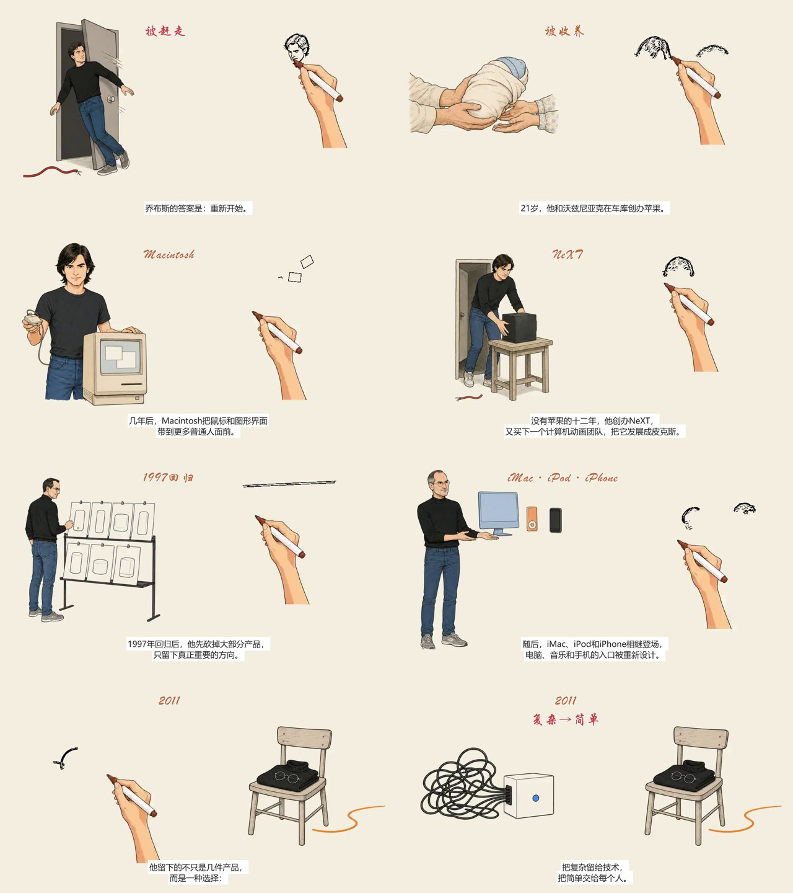
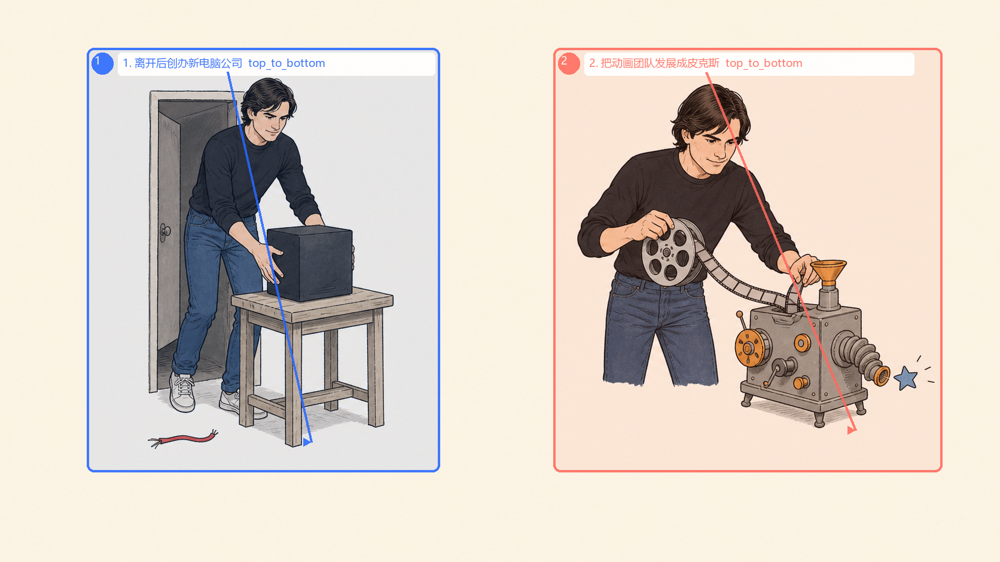

# Hand-drawn Explainer Video Nikola

一个面向中文知识讲解的 Codex Skill：把主题、文稿或 SRT 制作成“讲一部分、画一部分”的手绘视频，并交付真实 MP4、字幕、时间轴和可编辑素材。



## 它能做什么

- 逐笔人物故事：轮廓随旁白出现，随后补色，适合人物传记和历史故事；
- 双语义岛：先画左侧内容并讲解，再画右侧内容，用确定性关键词连接转折；
- Nikola 怪诞小黑草图：白底、稀疏黑线、少量红橙蓝批注，用荒诞动作解释抽象观点；
- 程序化知识图形：用 HTML/SVG/HyperFrames 制作流程、关系、卡片和精确文字；
- 只输出 Flow、Nano Banana 或其他图像/视频模型的自包含提示词。

这个仓库不把“手绘风静图平移”冒充逐笔绘制。逐笔路线使用内置的 MIT 后端，并在最终交付前检查真实视频、音轨、字幕、场景边界和末帧。

## 路线怎么选

| 你说的话 | 默认路线 |
|---|---|
| “边讲边画”“一笔一笔画出来”“笔尖跟着线走” | 逐笔故事 |
| “先画左边，再画右边，过程中写关键词” | 双语义岛逐笔故事 |
| “小黑、怪诞、白底、少量彩色批注” | Nikola 怪诞草图 + 逐笔路线 |
| “流程卡片、关系图、精确标签、独立元素运动” | 程序动画 |
| “只给我生图/图生视频提示词” | 提示词模式 |

完整风格说明见 [docs/STYLES.md](docs/STYLES.md)。

## 案例

### 乔布斯的一生：自然肤色 Q 版人物 + 双语义岛




- [完整 57 秒样片](examples/stroke-story/steve-jobs/steve-jobs-biography.mp4)
- [8.9 秒双岛代表镜头](examples/stroke-story/steve-jobs/semantic-island-sample.mp4)
- [源图、区域与时间说明](examples/stroke-story/steve-jobs/README.md)

### 程序动画

[可编辑 HTML/SVG/HyperFrames 工程](examples/program-animation/skill-demo/README.md) 展示流程卡片、人物动作、字幕和整段旁白时间轴。出于第三方许可考虑，GSAP 浏览器文件不直接提交，由 `npm install` 获取。

## 安装

最简单的方式是让 Codex 安装此仓库，或手动克隆：

```powershell
git clone https://github.com/hi-nikola/hand-drawn-explainer-video-nikola.git "$env:USERPROFILE/.codex/skills/hand-drawn-explainer-video-nikola"
python "$env:USERPROFILE/.codex/skills/hand-drawn-explainer-video-nikola/scripts/setup_check.py"
```

提示词模式到这里即可使用。运行脚本需要 Python 3.10+；Windows 若默认 `python` 较旧，请改用 `py -3.12` 或已确认的新版本解释器。逐笔视频首次使用还需：

```powershell
cd "$env:USERPROFILE/.codex/skills/hand-drawn-explainer-video-nikola"
python vendor/srt-whiteboard-animation/scripts/prepare_env.py
python scripts/stroke_story_preflight.py --report preflight-stroke-story.json
```

完整 MP4 需要 FFmpeg/FFprobe；程序动画需要 Node.js、浏览器和 HyperFrames。详见 [安装](docs/INSTALL.md)、[配置](docs/CONFIGURATION.md) 和 [排错](docs/TROUBLESHOOTING.md)。

## 直接可用的触发提示词

```text
使用 $hand-drawn-explainer-video-nikola，把下面内容做成 45 秒中文手绘讲解视频。讲一部分画一部分，先画左边再画右边，重要结论用准确关键词后期写出；使用自然肤色 Q 版人物，先做代表镜头验证，再交付真实 MP4、SRT、时间轴和可编辑素材。
```

```text
使用 $hand-drawn-explainer-video-nikola，用 Nikola 怪诞小黑草图解释这个方法：纯白背景、稀疏黑线、少量红橙蓝批注。要真实逐笔落墨，不要只做静图缩放；字幕和关键词必须准确。
```

```text
使用 $hand-drawn-explainer-video-nikola，把这段内容做成手绘风流程卡片动画。使用可编辑 SVG/HTML，所有标题、数字和箭头关系必须确定性生成，并验证最终 MP4。
```

## 目录

- `SKILL.md`：触发说明与总工作流；
- `references/`：逐笔、双语义岛、程序动画、声音和质量规范；
- `scripts/`：预检、配音辅助、最终合成和验证；
- `vendor/srt-whiteboard-animation/`：带来源说明的 MIT 逐笔运行时，不含第二个 Skill；
- `examples/`：公开样片、源图和可编辑工程；
- `docs/`：安装、配置、架构、风格和排错。

## 安全与费用

仓库不含 API Key、Token、Cookie、个人绝对路径或私有模型。云配音、生图和视频服务都是可选能力，可能收费；请先 Dry Run、复用内容匹配的缓存，并避免在结果未知时盲目重试。漏洞和凭据泄露报告见 [SECURITY.md](SECURITY.md)。

## 许可

Skill、原创脚本与文档使用 [Apache License 2.0](LICENSE)。`vendor/srt-whiteboard-animation/` 保留上游 MIT 许可。示例媒体按 [CC BY 4.0 媒体说明](LICENSE-MEDIA.md) 提供（仅限作者有权许可的部分）。第三方软件、人物姓名、产品名和商标不因此获得再许可，详见 [THIRD_PARTY_NOTICES.md](THIRD_PARTY_NOTICES.md)。

欢迎阅读 [CONTRIBUTING.md](CONTRIBUTING.md) 后提交新的风格预设、回归用例或渲染改进。
