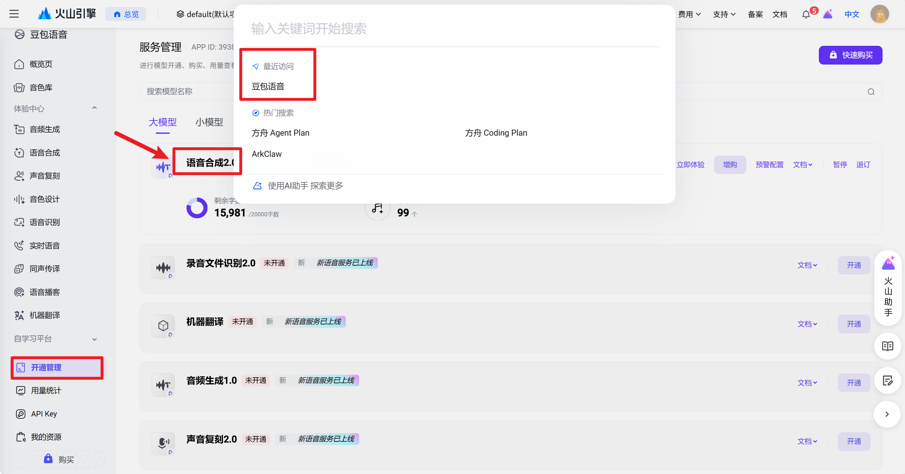

# Hand-drawn Explainer Video Nikola

作者 Nikola｜联系与交流：[X / Twitter @Nikola314159](https://x.com/Nikola314159)

一个面向中文知识讲解的 Codex Skill：把主题、文稿或 SRT 制作成“讲一部分、画一部分”的手绘视频，并交付真实 MP4、字幕、时间轴和可编辑素材。

这应该是目前手绘漫画效果最好的skills仓库了，我参考了许多大佬的方法，尝试了多次完成，TOKEN都要给我整完了。希望各位朋友喜欢，有问题直接推特留言或者提pr吧，未来也会持续维护这个仓库，并更新更多的功能。

过程示例：


## 它能做什么

本 Skill 只有两条制作路线。画面结构与视觉风格是逐笔路线中的可组合选项，不是额外路线：

```text
制作路线
├─ 逐笔故事动画
│  ├─ 画面结构：单场景 / 多幕故事 / 左右双语义岛
│  └─ 视觉风格：Q版人物 / 小黑风格 / 其他手绘风格
└─ 程序动画
   ├─ HTML / SVG / GSAP
   └─ 流程卡片 / 关系图 / 精确文字 / 知识图形
```

“左右双语义岛”是逐笔故事动画的一种画面组织方法：先画左边、讲完一部分，再画右边，并保留前面的内容。也可以使用单场景或多幕连续故事。Q 版人物与小黑风格是视觉风格：前者适合乔布斯传记、历史人物等，后者适合抽象观点、方法论和隐喻；两者都能使用双语义岛，也都能使用其他画面结构。

除此之外，本 Skill 也能只输出 Flow、Nano Banana 或其他图像/视频模型的自包含提示词；这是交付范围，不是第三条制作路线。

这个仓库不把“手绘风静图平移”冒充逐笔绘制。逐笔路线使用内置的 MIT 后端，并在最终交付前检查真实视频、音轨、字幕、场景边界和末帧。

## 路线怎么选

| 你说的话 | 默认路线 |
|---|---|
| “边讲边画”“一笔一笔画出来”“笔尖跟着线走” | 逐笔故事 |
| “先画左边，再画右边，过程中写关键词” | 逐笔故事 + 左右双语义岛画面结构 |
| “小黑、怪诞、白底、少量彩色批注” | 逐笔故事 + 小黑视觉风格 |
| “流程卡片、关系图、精确标签、独立元素运动” | 程序动画 |
| “只给我生图/图生视频提示词” | 提示词模式 |

完整风格说明见 [docs/STYLES.md](docs/STYLES.md)。

## 案例

### 《约法三章》：16:9 多幕逐笔故事动画


- [38.5 秒 16:9 手速平滑版 MP4](examples/stroke-story/yuefa-sanzhang/yuefa-sanzhang-16x9-stroke-story.mp4)
- [可编辑工程包](examples/stroke-story/yuefa-sanzhang/editable-project.zip)
- [七幕结构、时间轴与验证说明](examples/stroke-story/yuefa-sanzhang/README.md)

这是最终采用的优秀版本：七幅连续故事画面，每幕从空白纸张开始逐笔落墨，每幅只承载一个完整事件。旧的 9:16 单画布样片存在人物、道具和环境线条互相干扰的问题，因此不作为仓库推荐案例。

### 乔布斯的一生：自然肤色 Q 版人物 + 双语义岛


- [完整 57 秒样片](examples/stroke-story/steve-jobs/steve-jobs-biography.mp4)
- [8.9 秒双岛代表镜头](examples/stroke-story/steve-jobs/semantic-island-sample.mp4)
- [源图、区域与时间说明](examples/stroke-story/steve-jobs/README.md)

### “什么是 Skill”：程序动画


- [14 秒真实 MP4 样片](examples/program-animation/skill-demo/what-is-skill-sample.mp4)
- [可编辑 HTML/SVG/HyperFrames 工程与说明](examples/program-animation/skill-demo/README.md)

这个案例展示流程卡片、人物动作、字幕和真实旁白时间轴。出于第三方许可考虑，GSAP 浏览器文件不直接提交，由 `npm install` 获取。

《商用Skills_完整手绘视频》是程序化知识图形路线的完整生产案例：44 个场景中的人物、卡片、箭头、放大镜、字幕条等均作为独立 HTML/SVG 元素编排，再由 GSAP/HyperFrames 按真实旁白时间轴驱动。仓库中的 36 秒工程是便于下载和学习的精简公开示例，不包含那条 7 分 29 秒完整成片。

它与“边说边画”不是同一种实现：

| 对比项 | 程序化知识图形 | 逐笔“边说边画” |
|---|---|---|
| 画面如何出现 | 独立卡片、人物、箭头和文字按时间移动、缩放、切换或描边 | 同一画布按语义区域持续落墨，先线稿后补色，已画内容保留 |
| 核心技术 | HTML/SVG + GSAP + HyperFrames | 位图线稿提取 + skeleton/stream 连续笔迹 + 分区遮罩 |
| 最适合 | 流程、规则、关系、对比、精确文字 | 人物故事、历史叙事、白板讲解、一幅画逐步完成 |
| 不可混称 | 手绘风元素动画不等于真实逐笔绘制 | 不能用整图淡入、卡片飞入或 SVG 运动冒充落墨 |

## 配音默认

成片默认使用火山引擎语音合成的刘飞音色 `zh_male_liufei_uranus_bigtts`，资源模型为 `seed-tts-2.0`。用户明确指定时，可以改用火山引擎中的其他已授权音色；已有与文稿一致、质量合格的旁白则优先复用。

在火山引擎控制台进入“开通管理”，开通豆包语音的“语音合成 2.0”服务：



不建议把电脑系统朗读、edge-tts 或其他低质量本地文本转语音自动当作成片替代方案，它们与已验证的刘飞听感差异明显。若当前环境没有火山引擎授权或用户提供的合格音轨，应保留已完成的画面、字幕与时间轴并说明配音缺口，不应静默换成系统声音后宣称完成。详见 [配音与声音对齐](references/voiceover.md)。

## 安装

最简单的方式是让 Codex 安装此仓库，或手动克隆：

```powershell
git clone https://github.com/hi-nikola/hand-drawn-explainer-video-nikola.git "$env:USERPROFILE/.codex/skills/hand-drawn-explainer-video-nikola"
python "$env:USERPROFILE/.codex/skills/hand-drawn-explainer-video-nikola/scripts/setup_check.py"
```

提示词模式到这里即可使用。运行脚本需要 Python 3.10+；Windows 若默认 `python` 较旧，请改用 `py -3.12` 或已确认的新版本解释器。逐笔视频首次使用还需：

```powershell
cd "$env:USERPROFILE/.codex/skills/hand-drawn-explainer-video-nikola"
python vendor/srt-whiteboard-animation/scripts/prepare_env.py
python scripts/stroke_story_preflight.py --report preflight-stroke-story.json
```

完整 MP4 需要 FFmpeg/FFprobe；程序动画需要 Node.js、浏览器和 HyperFrames。详见 [安装](docs/INSTALL.md)、[配置](docs/CONFIGURATION.md) 和 [排错](docs/TROUBLESHOOTING.md)。

逐笔核心渲染不需要下载本地神经网络小模型或模型权重，也不要求 GPU；已有合格源图/线稿和旁白时，可以使用本地传统图像算法完成。首次安装 Python/npm 依赖需要联网，从文稿生成新插画或新合成刘飞配音则需要相应外部服务。

## 直接可用的触发提示词

```text
使用 $hand-drawn-explainer-video-nikola，把下面内容做成 45 秒中文手绘讲解视频。讲一部分画一部分，先画左边再画右边，重要结论用准确关键词后期写出；使用自然肤色 Q 版人物，先做代表镜头验证，再交付真实 MP4、SRT、时间轴和可编辑素材。
```

```text
使用 $hand-drawn-explainer-video-nikola，用小黑风格解释这个方法：纯白背景、稀疏黑线、少量红橙蓝批注。要真实逐笔落墨，不要只做静图缩放；字幕和关键词必须准确。
```

```text
使用 $hand-drawn-explainer-video-nikola，把这段内容做成手绘风流程卡片动画。使用可编辑 SVG/HTML，所有标题、数字和箭头关系必须确定性生成，并验证最终 MP4。
```

## 目录

- `SKILL.md`：触发说明与总工作流；
- `references/`：逐笔、双语义岛、程序动画、声音和质量规范；
- `scripts/`：预检、配音辅助、最终合成和验证；
- `vendor/srt-whiteboard-animation/`：带来源说明的 MIT 逐笔运行时，不含第二个 Skill；
- `examples/`：公开样片、源图和可编辑工程；
- `docs/`：安装、配置、架构、风格和排错。

## 安全与费用

仓库不含 API Key、Token、Cookie、个人绝对路径或私有模型。云配音、生图和视频服务都是可选能力，可能收费；请先 Dry Run、复用内容匹配的缓存，并避免在结果未知时盲目重试。漏洞和凭据泄露报告见 [SECURITY.md](SECURITY.md)。

## 许可

Skill、原创脚本与文档使用 [Apache License 2.0](LICENSE)。`vendor/srt-whiteboard-animation/` 保留上游 MIT 许可。示例媒体按 [CC BY 4.0 媒体说明](LICENSE-MEDIA.md) 提供（仅限作者有权许可的部分）。第三方软件、人物姓名、产品名和商标不因此获得再许可，详见 [THIRD_PARTY_NOTICES.md](THIRD_PARTY_NOTICES.md)。

欢迎阅读 [CONTRIBUTING.md](CONTRIBUTING.md) 后提交新的风格预设、回归用例或渲染改进。

## 致谢

感谢以下开源项目及其作者分享思路、代码和可复用经验；本仓库只在各自许可与说明范围内借鉴或使用，具体代码来源边界见 [第三方说明](THIRD_PARTY_NOTICES.md)。

- [kaomei/hand-drawn-video-prompts](https://github.com/kaomei/hand-drawn-video-prompts)：中文口播分镜、Q 版蜡笔视觉规范与提示词工作流；
- [geeklee/srt-whiteboard-animation](https://github.com/geeklee/srt-whiteboard-animation)：SRT 语义分区、持续画布与 stream 连续笔迹；
- [gnipbao/story-to-handdrawn-video](https://github.com/gnipbao/story-to-handdrawn-video)：故事到手绘漫画、线稿/彩图配合与风格组织；
- [ChenShuo2004/cs-board](https://github.com/ChenShuo2004/cs-board)：完整白板视频工作台、骨架笔迹与生产流程方面的实践；
- [heygen-com/hyperframes-launches](https://github.com/heygen-com/hyperframes-launches)：HyperFrames 程序动画的镜头与合成范例；
- [Vincentwei1021/video-shotcraft](https://github.com/Vincentwei1021/video-shotcraft)：可复用镜头结构与程序化视频编排思路。
- [helloianneo/ian-xiaohei-illustrations](https://github.com/helloianneo/ian-xiaohei-illustrations)：感谢 Ian 开源“小黑”视觉 IP 与配图 Skill；本仓库的小黑风格借鉴了其黑色实心小角色、白点眼、纯白手绘、大量留白和少量红橙蓝批注的视觉语言。

向每一位愿意公开工具、案例和踩坑经验的创作者表示感谢。
