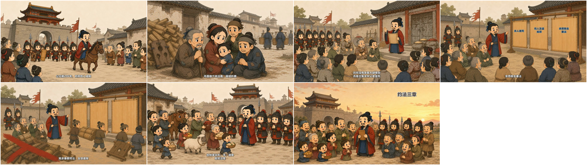
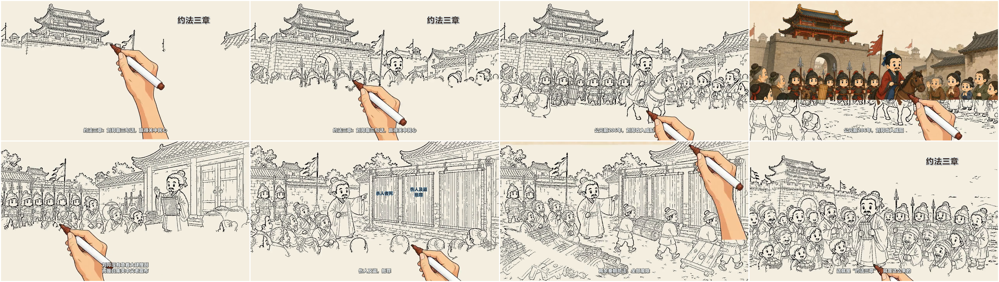

# 《约法三章》：16:9 多幕逐笔故事动画案例

这是最终采用的 38.5 秒横屏版本，1920×1080、30fps。它把完整口播拆成七幅连续历史故事画面，每幕从空白纸张开始，以 `skeleton` 连续落墨并完成彩色补全，完成后短暂停留，再自然切换到下一幕。

- [观看 38.5 秒手速平滑版 MP4](yuefa-sanzhang-16x9-stroke-story.mp4)
- [下载可编辑工程包](editable-project.zip)：包含七张彩色源图、逐幕标注、刘飞旁白、字幕、确定性文字层、时间轴和渲染文件；
- `timeline.json`：七幕真实旁白时间轴；
- `verification.json`：视频解码、音频、字幕和逐幕运动检查；
- `seven-scenes-final-frames.jpg`：七幕最终画面检查；
- `hand-speed-contact-sheet.jpg`：落墨过程与手部移动检查。

七幕依次为：刘邦攻入咸阳、百姓忧惧、召集关中父老、宣布三条约法、废除秦朝苛法、秦人慰劳汉军、赢得关中民心。音轨复用已确认的火山引擎刘飞配音 `zh_male_liufei_uranus_bigtts`。成片实际解码 1155 帧，自动检查无错误、无警告。

## 为什么不用旧竖屏样片

旧的 9:16 单幅画布把复杂历史群像、人物、道具和环境压在同一画面，容易出现画面元素互相干扰与跨区域串线。最终版不再强制四宫格或贴纸式语义岛，而采用“多幕连续故事”：每幅只承担一个完整事件，人物和环境可以在本幕自然接触，并从幕与幕的边界消除干扰。

这说明“逐笔故事动画”不等于必须使用左右双语义岛。复杂历史故事在用户未限定竖屏时，应优先考虑 16:9 多幕结构。手速平滑版使用 `--hand-follow 0.35` 缓动手部追随，但不改变旁白、笔迹或场景时长。

这里的“逐笔”指程序化骨架追踪与轮廓感知上色，并非声称逐笔复刻真人的自然笔顺。它与 SVG 卡片移动、整图淡入或镜头缩放不同。

工程包用于复现案例，不代表新项目必须复制同一故事、时长或人物。解压后先按仓库安装文档创建逐笔隔离环境；其中路径应按本机位置重新选择，不要沿用其他电脑的绝对路径。
